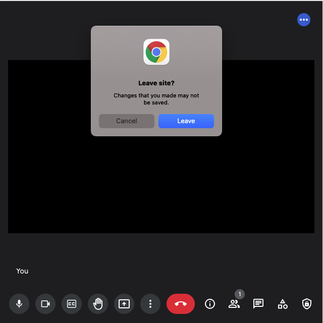
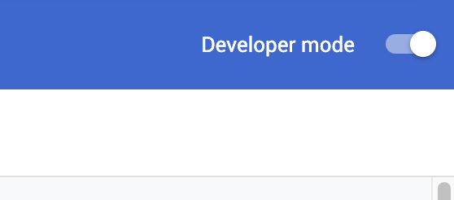
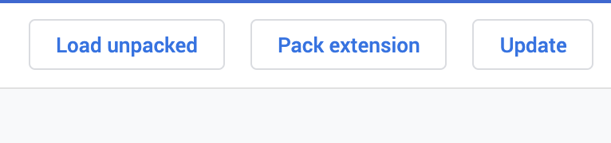
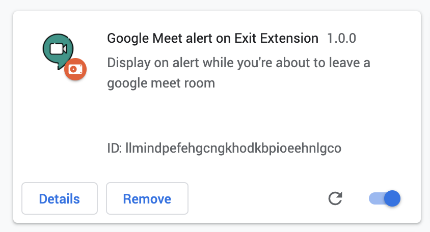

# Google Meet alert on exit chrome extension

## Disclaimer

This extension will alter the normal behaviour of google meet, use at your own risk. 

## How it works ? 
When leaving a google meet call, it will display a confirmation dialog. At this point you're not in the call anymore. 
- If you click **leave** it will close the page or open the new depending on which action made you left the call.
- If you click **cancel** the extension will reload the page and rejoin automatically the call. **Be aware of that**

# Screenshot

# Installation

First download the `zip` file of the extension here : [google-meet-alert-on-exit-chrome-extension.zip](https://codeload.github.com/florianpasteur/google-meet-alert-on-exit-chrome-extension/zip/refs/heads/master)

Unzip the content of the zip at the location of your convenience, for example you could create a folder in your home: `~/.chrome-extensions/` 

Go to [chrome://extensions/](chrome://extensions/) and activate the `Developer mode`

You're now able to load the extension, click on `Load unpacked` and select the location where you've unzipped the extension.

You should now see the extension in your list:

